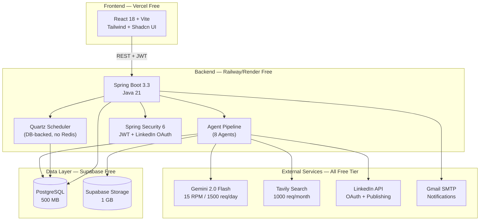
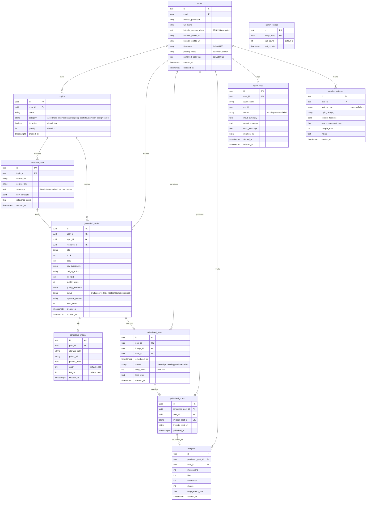
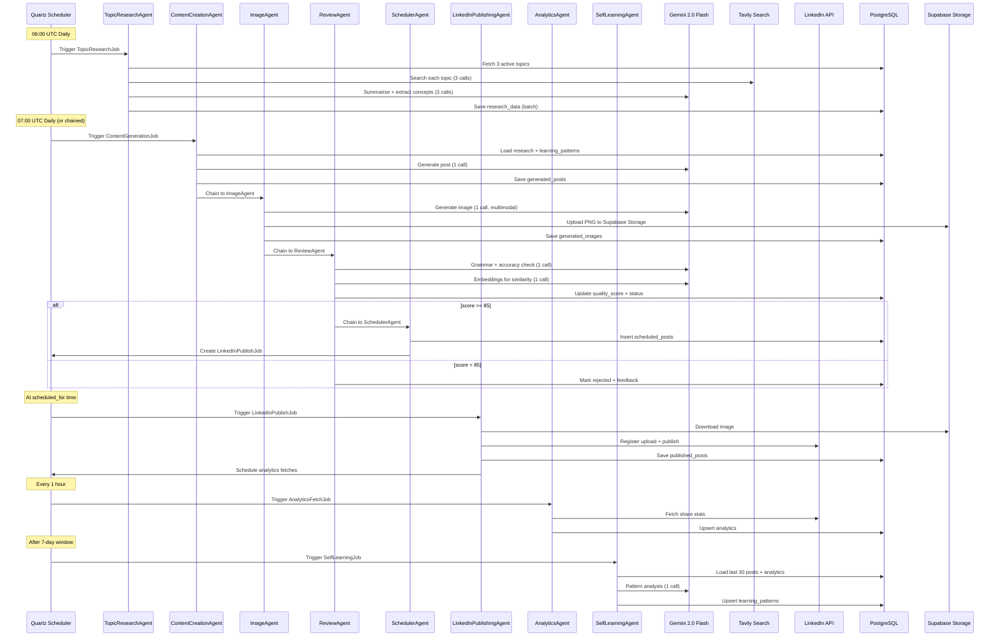
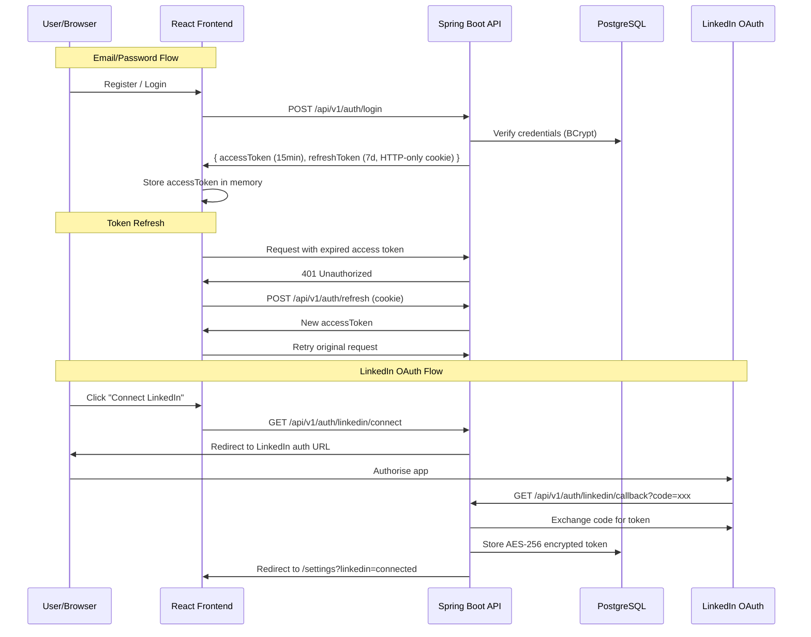
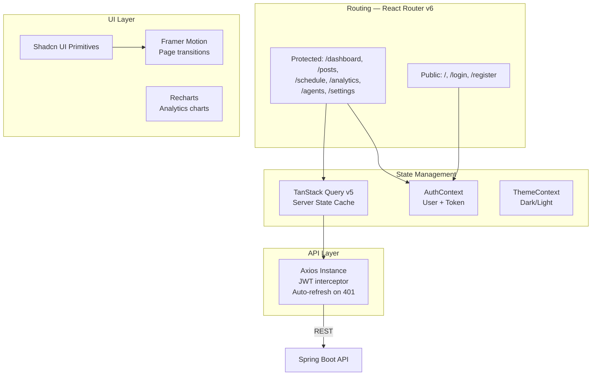
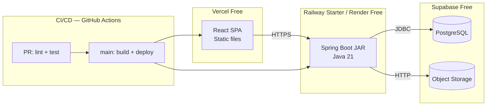

# LinkedIn AI Agent — Architecture

> Multi-agent SaaS that researches topics, creates LinkedIn posts + images,
> schedules, publishes, tracks analytics, and self-improves.
> **Every design decision optimises for free-tier limits.**

---

## 1. High-Level System Diagram



---

## 2. Monorepo Structure

```
linkedin-ai-agent/
├── apps/
│   ├── web/                          # React 18 frontend (Vite)
│   │   ├── public/
│   │   ├── src/
│   │   │   ├── components/
│   │   │   │   ├── ui/               # Shadcn UI primitives
│   │   │   │   ├── dashboard/        # StatCard, GeminiUsageBar, AgentTimeline
│   │   │   │   ├── posts/            # PostCard, QualityScore, LinkedInPreview
│   │   │   │   ├── schedule/         # PostCalendar
│   │   │   │   ├── analytics/        # EngagementChart
│   │   │   │   ├── agents/           # AgentStatusBadge, AgentTimeline
│   │   │   │   ├── topics/           # TopicManager
│   │   │   │   └── layout/           # Navbar, Sidebar, ThemeToggle
│   │   │   ├── pages/                # Route-level components
│   │   │   ├── hooks/                # Custom hooks (useAuth, usePosts, etc.)
│   │   │   ├── lib/                  # axios instance, query client, utils
│   │   │   ├── types/                # Generated from OpenAPI + manual
│   │   │   ├── context/              # AuthContext, ThemeContext
│   │   │   └── App.tsx / main.tsx
│   │   ├── index.html
│   │   ├── vite.config.ts
│   │   ├── tailwind.config.ts
│   │   ├── tsconfig.json
│   │   └── package.json
│   │
│   └── api/                          # Spring Boot backend
│       ├── src/main/java/com/linkedinagent/
│       │   ├── LinkedinAgentApplication.java
│       │   ├── config/
│       │   │   ├── SecurityConfig.java
│       │   │   ├── QuartzConfig.java
│       │   │   ├── SpringAIConfig.java
│       │   │   ├── SupabaseConfig.java
│       │   │   ├── RateLimiterConfig.java
│       │   │   ├── JacksonConfig.java
│       │   │   └── CorsConfig.java
│       │   ├── controller/
│       │   │   ├── AuthController.java
│       │   │   ├── DashboardController.java
│       │   │   ├── TopicController.java
│       │   │   ├── PostController.java
│       │   │   ├── ScheduleController.java
│       │   │   ├── AnalyticsController.java
│       │   │   ├── SettingsController.java
│       │   │   ├── AgentController.java
│       │   │   └── UsageController.java
│       │   ├── service/
│       │   │   ├── AuthService.java
│       │   │   ├── TopicService.java
│       │   │   ├── PostService.java
│       │   │   ├── ScheduleService.java
│       │   │   ├── AnalyticsService.java
│       │   │   ├── UserService.java
│       │   │   └── GeminiUsageService.java
│       │   ├── agent/
│       │   │   ├── TopicResearchAgent.java
│       │   │   ├── ContentCreationAgent.java
│       │   │   ├── ImageAgent.java
│       │   │   ├── ReviewAgent.java
│       │   │   ├── SchedulerAgent.java
│       │   │   ├── LinkedInPublishingAgent.java
│       │   │   ├── AnalyticsAgent.java
│       │   │   ├── SelfLearningAgent.java
│       │   │   └── AgentPipelineOrchestrator.java
│       │   ├── job/
│       │   │   ├── TopicResearchJob.java
│       │   │   ├── ContentGenerationJob.java
│       │   │   ├── LinkedInPublishJob.java
│       │   │   ├── AnalyticsFetchJob.java
│       │   │   ├── PurgeOldLogsJob.java
│       │   │   └── SelfLearningJob.java
│       │   ├── repository/
│       │   │   ├── UserRepository.java
│       │   │   ├── TopicRepository.java
│       │   │   ├── ResearchDataRepository.java
│       │   │   ├── GeneratedPostRepository.java
│       │   │   ├── GeneratedImageRepository.java
│       │   │   ├── ScheduledPostRepository.java
│       │   │   ├── PublishedPostRepository.java
│       │   │   ├── AnalyticsRepository.java
│       │   │   ├── AgentLogRepository.java
│       │   │   ├── LearningPatternRepository.java
│       │   │   └── GeminiUsageRepository.java
│       │   ├── entity/
│       │   │   ├── User.java
│       │   │   ├── Topic.java
│       │   │   ├── ResearchData.java
│       │   │   ├── GeneratedPost.java
│       │   │   ├── GeneratedImage.java
│       │   │   ├── ScheduledPost.java
│       │   │   ├── PublishedPost.java
│       │   │   ├── Analytics.java
│       │   │   ├── AgentLog.java
│       │   │   ├── LearningPattern.java
│       │   │   └── GeminiUsage.java
│       │   ├── dto/
│       │   │   ├── request/            # RegisterRequest, LoginRequest, etc.
│       │   │   └── response/           # AuthResponse, DashboardSummary, etc.
│       │   ├── exception/
│       │   │   ├── AgentException.java
│       │   │   ├── LinkedInApiException.java
│       │   │   ├── StorageException.java
│       │   │   ├── RateLimitException.java
│       │   │   ├── BudgetExceededException.java
│       │   │   └── GlobalExceptionHandler.java
│       │   ├── security/
│       │   │   ├── JwtTokenProvider.java
│       │   │   ├── JwtAuthFilter.java
│       │   │   └── LinkedInOAuthHandler.java
│       │   └── util/
│       │       ├── ReadabilityUtil.java
│       │       ├── GeminiRateLimiter.java
│       │       ├── EncryptionUtil.java
│       │       └── SupabaseStorageClient.java
│       ├── src/main/resources/
│       │   ├── application.yml
│       │   ├── application-dev.yml
│       │   ├── application-prod.yml
│       │   └── db/migration/
│       │       ├── V1__init.sql
│       │       └── V2__quartz.sql
│       ├── src/test/java/com/linkedinagent/
│       │   ├── agent/                  # Agent unit tests
│       │   ├── controller/             # Controller integration tests
│       │   ├── service/                # Service unit tests
│       │   └── util/                   # Utility tests
│       ├── pom.xml
│       └── Dockerfile
│
├── packages/
│   └── shared-types/                   # OpenAPI-generated TS types
│       ├── package.json
│       └── src/
│
├── infra/
│   ├── docker-compose.yml
│   ├── docker-compose.prod.yml
│   └── nginx/
│       └── default.conf
│
├── scripts/
│   └── seed.sql
│
├── docs/
│   ├── ARCHITECTURE.md                 # (this file)
│   └── API.md
│
├── .env.example
├── .github/workflows/
│   ├── ci.yml
│   └── deploy.yml
├── .gitignore
└── README.md
```

---

## 3. Data Model (ER Diagram)



---

## 4. Agent Pipeline Architecture



### Gemini Call Budget Per Full Pipeline Run

| Agent | Gemini Calls | Purpose |
|---|---|---|
| TopicResearchAgent | 3 | 1 per topic (max 3 topics) |
| ContentCreationAgent | 1 | Generate post content |
| ImageAgent | 1 | Multimodal image generation |
| ReviewAgent | 2 | Combined review + embeddings |
| SchedulerAgent | 0 | Pure DB + Quartz |
| LinkedInPublishingAgent | 0 | LinkedIn API only |
| AnalyticsAgent | 0 | LinkedIn API only |
| SelfLearningAgent | 1 | Pattern analysis |
| **Total** | **8** | **Well under 10/run, 1500/day** |

---

## 5. Authentication & Security Architecture



---

## 6. Free-Tier Constraint Map

| Service | Limit | Our Budget | Guard Mechanism |
|---|---|---|---|
| Gemini 2.0 Flash RPM | 15 RPM | 12 RPM | Resilience4j `RateLimiter` bean |
| Gemini 2.0 Flash Daily | 1500 req/day | 1400 req/day | `gemini_usage` table + `BudgetExceededException` |
| Gemini TPM | 1M TPM | ~50K per run | Prompt length limits in agents |
| Supabase DB | 500 MB | ~100 MB target | No raw content storage; summaries only; 90-day log purge |
| Supabase Storage | 1 GB | ~500 MB target | 1080×1080 PNG (~200KB each), ~2500 images |
| Supabase Bandwidth | 2 GB/month | ~1 GB target | Image CDN via public URLs, no re-downloads |
| Tavily Search | 1000 req/month | ~90/month | 3 topics × 30 days = 90 |
| Gmail SMTP | 500/day | ~5/day | Only critical notifications |

---

## 7. Resilience & Error Handling

```
┌─────────────────────────────────────────────┐
│            GlobalExceptionHandler           │
│         (@ControllerAdvice)                 │
│                                             │
│  AgentException        → 500 AGENT_ERROR    │
│  LinkedInApiException  → 502 LINKEDIN_ERROR │
│  StorageException      → 502 STORAGE_ERROR  │
│  RateLimitException    → 429 RATE_LIMITED   │
│  BudgetExceededException → 429 BUDGET_EXCEEDED│
│  MethodArgumentNotValid → 400 VALIDATION_ERROR│
│  AccessDeniedException → 403 FORBIDDEN      │
│  All others            → 500 INTERNAL_ERROR │
└─────────────────────────────────────────────┘

Resilience4j annotations on external calls:
  @Retry(name = "gemini",  maxAttempts = 3, waitDuration = 2s)
  @Retry(name = "linkedin", maxAttempts = 3, exponentialBackoff)
  @CircuitBreaker(name = "gemini", failureRateThreshold = 50)
  @RateLimiter(name = "gemini", limitForPeriod = 12, limitRefreshPeriod = 60s)
```

---

## 8. Frontend Architecture



### Page → Component Map

| Page | Key Components |
|---|---|
| `/dashboard` | StatCard ×4, GeminiUsageBar, AgentTimeline, EngagementChart |
| `/posts` | PostCard list, QualityScore, LinkedInPreview, ContentEditor |
| `/schedule` | PostCalendar (weekly grid), time picker |
| `/analytics` | EngagementChart (Recharts Line), stat cards, insights list |
| `/agents` | AgentStatusBadge (pulse dot), AgentTimeline (vertical feed), log viewer |
| `/settings` | TopicManager (tag selector, max 7), LinkedIn connect, theme, posting mode |

---

## 9. Deployment Architecture



---

## 10. Key Design Decisions

| Decision | Rationale |
|---|---|
| No Redis | Quartz DB-backed scheduler eliminates Redis cost entirely |
| No raw content in DB | Supabase free tier is 500 MB; store Gemini summaries only |
| Single Gemini API key | Google AI Studio key works without GCP billing |
| 10-call pipeline cap | 8 actual calls per full run; leaves headroom for retries |
| `jsonb` for flexible fields | Avoids extra tables for key_concepts, quality_feedback, etc. |
| AES-256 for LinkedIn tokens | Encrypted at rest in DB, decrypted only at publish time |
| 90-day log purge | Weekly Quartz job keeps agent_logs table lean |
| Batch DB writes | `saveAll()` everywhere; never row-by-row in loops |
| Quartz PostgreSQL DDL via Flyway | Standard `V2__quartz.sql` keeps schema versioned |
| JWT access + refresh split | 15-min access for security, 7-day refresh for UX |
